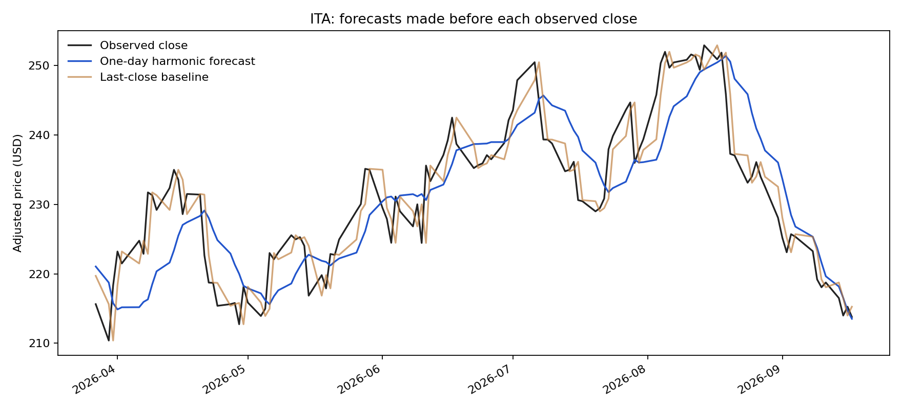

# Recent-weighted harmonic forecasting

A small ITA forecasting experiment: a constant plus one or two phase-shifted sine waves, with no straight-line trend. Sine and cosine coefficients are fitted by weighted least squares; each pair is equivalent to an amplitude and phase shift.

## Run

```sh
python harmonic.py --data /path/to/ita_daily_adjusted.csv
python -m unittest discover -s tests
```

Input: a CSV with increasing unique `Date` values and positive adjusted `Close` prices. The local experiment uses the earlier project's cached Yahoo/yfinance snapshot, ending 17 September 2026. Raw prices are not redistributed here; the metrics record the snapshot hash.

## Method

Every forecast uses only the preceding 120 trading observations. Observations receive weights `2 ** (-age / half_life)`. Least squares fits the coefficients, then evaluates the fitted curve one trading step beyond the window. There is no neural network and no trend term.

Nine configurations were compared on 2018–2021: periods of 60 days, 120 days, or a pair of 20 and 60 days; each with a weighting half-life of 10, 30 or 60 days. Periods are fixed candidates, not continuously optimised frequencies. The lowest calibration RMSE selected a 120-day wave with a 10-day half-life. Coefficients are refitted daily; the selected configuration remains fixed for the later period.

## Result

On 1,181 subsequent trading observations from 3 January 2022 to 17 September 2026:

| Model | Normalised prediction RMSE |
|---|---:|
| Predict the previous close | 1.2813% |
| Weighted harmonic model | 2.1409% |

The harmonic model's RMSE was **67.1% higher**. The paired 20-day moving-block bootstrap interval for the increase was approximately 57.2–76.7%. This interval is conditional on the selected model and data; it does not include uncertainty from trying alternative project ideas.

RMSE here means the root mean square of `(forecast - actual) / previous close`, expressed as a percentage. It is not directional accuracy, a return, or a profit measure. Baseline and model forecast the same next adjusted close. Previous observations before 2018 provide filter-window history.

This is a retrospective experiment. The later period was already explored in previous projects and should not be described as a completely untouched holdout. Prices come from a cached adjusted series, not a live feed or independently verified point-in-time archive. No costs or executable trading strategy are modelled.

The model is simple enough to understand, but these results do not support using it to predict ITA. A periodic curve can fit recent prices while extrapolating poorly.



## Ten-wave follow-up

Run with `--ten-waves --output results/harmonic-ten`. This keeps the original experiment intact. It uses 504 preceding observations and ten fixed periods: `252/k` trading days for k from 1 to 10 (252 down to 25.2 days). These are a simple harmonic basis, not evidence of annual market cycles. The 21 coefficients are fitted daily, with no trend or regularisation. Calibration chooses among half-lives of 20, 60, 120 and 252 trading days.

Calibration selected 20 days. On the same 1,181 later observations, normalised RMSE was **1.8568%**, versus **1.2813%** for the last-close baseline: **44.9% higher error** (conditional block-bootstrap interval: 37.7–52.8% higher). This is better than the first harmonic experiment but still substantially worse than the baseline. Both the window and the waves changed, so the difference cannot be attributed solely to adding waves. This is further exploratory reuse of the same later period, not fresh independent confirmation.
