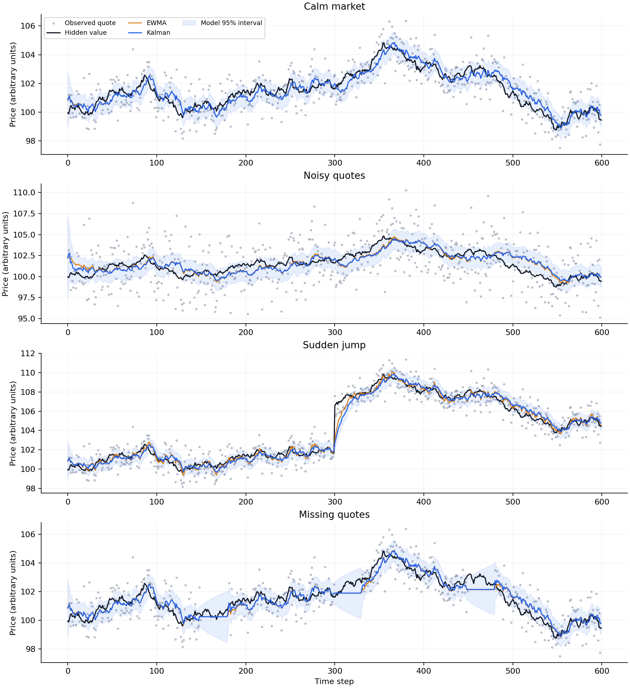

# Fair-value estimation

How much of a price movement is signal, and how much is noise?

This experiment compares a scalar Kalman filter, an exponential moving average (EWMA), and the latest observed price. The market is simulated so the underlying value is known and estimation error can be measured directly. This is price filtering, not a valuation of a company's fundamentals or a trading strategy.



## Results

Mean root-mean-square error across 100 paths per scenario, each 600 steps long. Lower is better; units are arbitrary price units.

| Scenario | Latest price | EWMA | Kalman |
|---|---:|---:|---:|
| Calm market | 1.003 | 0.385 | 0.381 |
| Noisy quotes | 2.507 | 0.682 | 0.637 |
| Sudden jump | 1.003 | 0.480 | 0.513 |
| Missing quotes | 1.021 | 0.451 | 0.442 |

The filter suppresses observation noise, but it lags sudden changes. A moving average calibrated on jump-containing paths responds faster and wins the jump scenario. When quotes disappear, the Kalman filter holds its estimate while increasing uncertainty, then gives the returning quote more weight.

The calm-market difference is small for a reason: with constant noise levels and uninterrupted observations, the Kalman gain converges to a constant. It then behaves like an EWMA. The tests check that equivalence. These averages describe this simulation; they do not establish a statistically significant or universal advantage.

## Run

Use Python 3.10 or newer with NumPy and Matplotlib. `requirements.txt` pins the direct dependencies used for the saved results.

```bash
python3 -m venv .venv
source .venv/bin/activate
python -m pip install -r requirements.txt
python -m unittest discover -s tests -v
python fair_value.py
```

No data download, API key or GPU is required. The default run writes to `results/`. Use another directory to preserve the checked-in results:

```bash
python fair_value.py --repeats 100 --output results-new
```

`runs.csv` contains every path's errors and Kalman interval coverage; `config.json` records seeds, parameters and package versions. `results.md` contains the generated summary. The figure always uses seed 1000, chosen before evaluation rather than selected for appearance.

## The model

The hidden value follows a random walk:

```
value[t] = value[t-1] + process noise
quote[t] = value[t] + observation noise
```

Both noise terms are independent, zero-mean Gaussian variables. Their variances are Q and R. The jump scenario adds 5 units halfway through; the filter is not told about that jump. Missing-quote scenarios remove three 30-step intervals.

The filter starts at the first quote with uncertainty R. For each subsequent time step:

```python
predicted_variance = variance + Q
weight = predicted_variance / (predicted_variance + R)
estimate = estimate + weight * (quote - estimate)
variance = (1 - weight) * predicted_variance
```

A noisy quote gets less weight. An uncertain estimate gets corrected more strongly. Without a quote, only the uncertainty increases. See [WALKTHROUGH.md](WALKTHROUGH.md) for a worked example and the code reading order.

## Comparison design

- All estimators use only current and previous observations. The first quote initialises all three; evaluation includes that initialisation period.
- The Kalman filter receives the simulator's true Q and R. This is an idealised advantage: these parameters would need estimation in a real application.
- EWMA's weight is selected from 100 candidates using ten separate calibration paths per scenario. Evaluation uses seeds 1000–1099, with no tuning on those paths.
- Calibration has access to hidden simulated values and the scenario type, including jumps. That is also privileged information, not an implementable real-market tuning recipe.
- The latest-price baseline carries the last quote forward during gaps. EWMA holds its estimate and keeps a fixed weight when quotes resume; Kalman updates its weight with elapsed uncertainty.
- The shaded interval is implied by the filter's assumptions. It is not guaranteed to contain the value 95% of the time, particularly after a jump.

## Scope

The core filter is about 25 lines. The rest generates data, evaluates the baselines and draws the figure. This is a statistical estimation project, not neural-network training. There are no earnings, order books, bid–ask bounce, transaction costs or profit claims. A useful next experiment would estimate Q and R from observations and test sensitivity to wrong assumptions.

Background: [Welch and Bishop, An Introduction to the Kalman Filter](https://www.cs.unc.edu/~welch/media/pdf/kalman_intro.pdf).
